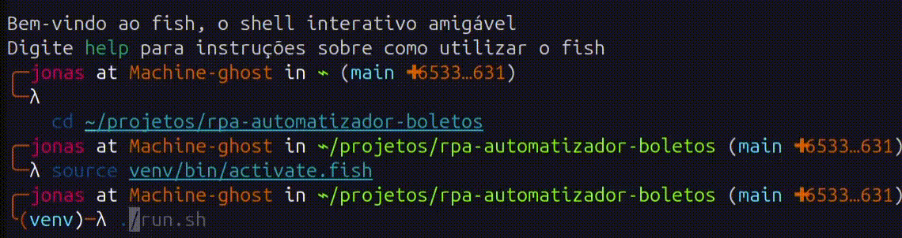

# 📂 RPA - Automatizador de Boletos PDF




Automatizador de boletos em PDF com RPA desenvolvido em **Python**.  
Esse projeto extrai automaticamente dados como **CNPJ**, **valor** e **data de vencimento** de boletos em formato PDF, exportando para um arquivo **CSV** pronto para uso em sistemas financeiros.

---

## 🚀 Tecnologias usadas

- Python 3.12  
- [PyPDF](https://pypi.org/project/pypdf/)  
- [Pandas](https://pandas.pydata.org/)  
- Docker  
- GitHub Actions (CI/CD)  
- Shell Script (`run.sh`)

---

## 💻 Como usar localmente

1. **Clone o projeto**:
   ```bash
   git clone https://github.com/seu-usuario/rpa-automatizador-boletos.git
   cd rpa-automatizador-boletos

